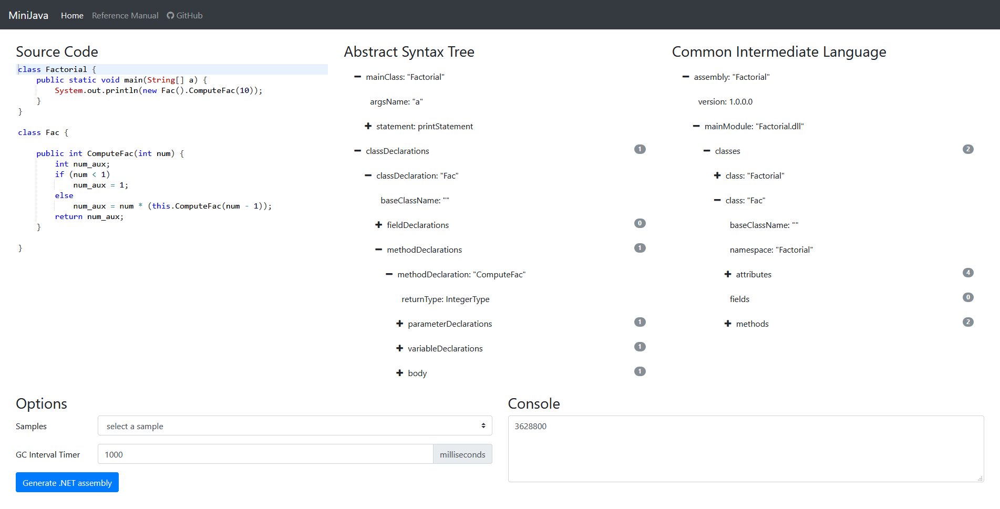

# MiniJava

### [**Playground**](http://minijava.azurewebsites.net/ "Try MiniJava")



MiniJava is a [small subset](#grammar) of Java.

The meaning of a MiniJava program is given by its meaning as a Java program.
Overloading is not allowed in MiniJava.
The MiniJava statement `System.out.println(expr);` can only print integers.
The MiniJava expression `expr.length` only applies to expressions of type `int[]`.

The program operates in four main stages:

1. Parse source file to generate a syntax tree, report any syntax errors.
2. Traverse the syntax tree, building a symbol table and reporting any semantic errors.
3. Interpret and print the results to console.
4. Generate CIL (MSIL) bytecode.

## Grammar
```
Program           ::= MainClass ( ClassDeclaration )* <EOF>
MainClass         ::= "class" Identifier "{" "public" "static" "void" "main" "(" "String" "[" "]" Identifier ")" "{" Statement "}" "}"
ClassDeclaration  ::= "class" Identifier ( "extends" Identifier )? "{" ( VarDeclaration )* ( MethodDeclaration )* "}"
VarDeclaration    ::= Type Identifier ";"
MethodDeclaration ::= "public" Type Identifier "(" ( Type Identifier ( "," Type Identifier )* )? ")" "{" ( VarDeclaration )* ( Statement )* "return" Expression ";" "}"
Type              ::= "int" "[" "]"
                  |   "boolean"
                  |   "int"
                  |   Identifier
Statement         ::= "{" ( Statement )* "}"
                  |   "if" "(" Expression ")" Statement "else" Statement
                  |   "while" "(" Expression ")" Statement
                  |   "System.out.println" "(" Expression ")" ";"
                  |   Identifier "=" Expression ";"
                  |   Identifier "[" Expression "]" "=" Expression ";"
Expression        ::= Expression ( "&&" | "<" | "+" | "-" | "*" ) Expression
                  |   Expression "[" Expression "]"
                  |   Expression "." "length"
                  |   Expression "." Identifier "(" ( Expression ( "," Expression )* )? ")"
                  |   <INTEGER_LITERAL>
                  |   "true"
                  |   "false"
                  |   Identifier
                  |   "this"
                  |   "new" "int" "[" Expression "]"
                  |   "new" Identifier "(" ")"
                  |   "!" Expression
                  |   "(" Expression ")"
Identifier        ::= <IDENTIFIER>
```

## Lexical Issues

- **Identifiers**: An identifier is a sequence of letters, digits, and underscores, starting with a letter. Uppercase letters are distinguished from lowercase.
- **Integer literals**: A sequence of decimal digits is an integer constant that denotes the corresponding integer value.</dd>
- **Comments**: A comment may appear between any two tokens. There are two forms of comments: one starts with `/*`, ends with `*/`; another begins with `//` and goes to the end of the line.

## Sample Program
```
class Factorial {
    public static void main(String[] a) {
        System.out.println(new Fac().ComputeFac(10));
    }
}

class Fac {
    public int ComputeFac(int num) {
        int num_aux;

        if (num < 1) num_aux = 1;
        else num_aux = num * (this.ComputeFac(num - 1));

        return num_aux;
    }
}
```

## Usage

```
let source = "<MiniJava source code>"
let result =
    Utils.result {
        let input = Input.create source
        let! tokens = Lexer.tokenize input
        let! program = Parser.parse tokens
        let! symbolTable = SymbolCollector.create program
        let! _ = TypeChecker.check symbolTable program
        let! _ = VariableInitializationChecker.check program
        let env = Environment.create symbolTable program (printfn "%d") 1000L
        let! newEnv = Interpreter.interpret env
        let! assembly = ILBuilder.build symbolTable program
        let! app = CodeGenerator.generate assembly
        return newEnv, assembly, app
    }
```
